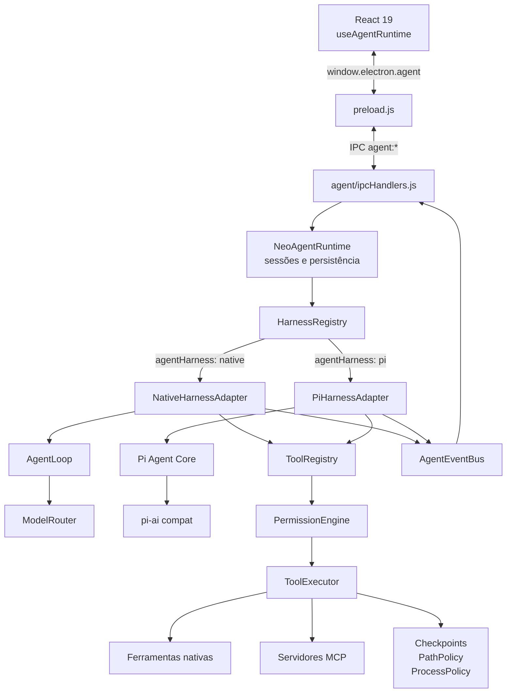
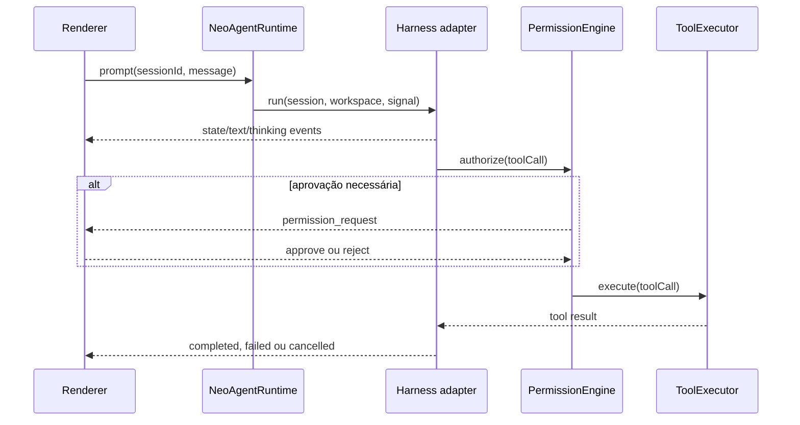
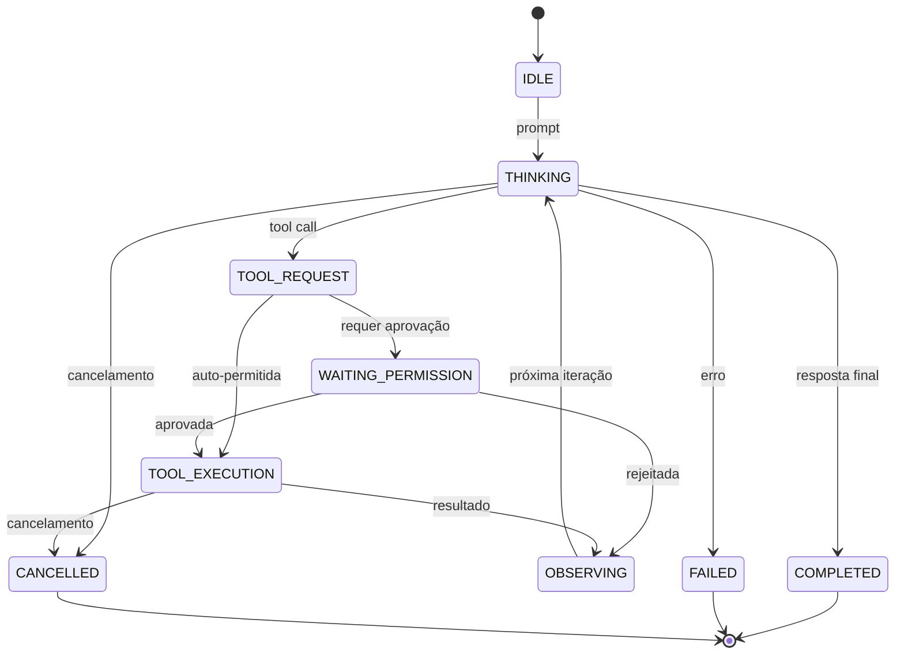

# Neo Agent Runtime

O **Neo Agent Runtime** (`electron/agent/`) é a camada autônoma do NeoChat Desktop. Ele mantém sessões, contexto de workspace, ferramentas, permissões, checkpoints e eventos sob controle do aplicativo, enquanto permite escolher o motor que conduz o loop do agente.

Atualmente existem dois harnesses:

- **Neo Native** (`native`): implementação padrão baseada em `agentLoop.js` e `modelRouter.js`.
- **Pi** (`pi`): adapter baseado em `@earendil-works/pi-agent-core` e `@earendil-works/pi-ai`.

O harness selecionado muda a orquestração do modelo, mas não muda a fronteira de segurança: ambos usam o mesmo catálogo de ferramentas, motor de permissões, executor, políticas de caminhos e processos, checkpoints e protocolo de eventos.

---

## Arquitetura



### Responsabilidades centrais

| Componente | Responsabilidade |
| :--- | :--- |
| `runtime.js` | Fachada do subsistema, ciclo de vida de sessões, workspace, cancelamento, rollback e despacho para o harness. |
| `harnessRegistry.js` | Registra adapters, normaliza `agentHarness`, lista opções para a UI e resolve o harness ativo. |
| `harnesses/nativeHarness.js` | Adapta a interface comum ao `AgentLoop` existente. |
| `harnesses/piHarness.js` | Converte mensagens e ferramentas entre Neo e Pi, conduz o Pi Agent Core e traduz sua saída para eventos Neo. |
| `agentLoop.js` | Loop ReAct e máquina de estados do harness nativo. |
| `modelRouter.js` | Normalização e streaming multi-provider usados pelo harness nativo. |
| `toolRegistry.js` | Catálogo único de ferramentas nativas e MCP. |
| `permissionEngine.js` | Decide `ALLOW`, `PROMPT` ou `DENY` para cada chamada. |
| `toolExecutor.js` | Executa ferramentas sob as políticas do runtime. |
| `eventBus.js` | Contrato de eventos consumido pelo renderer, independentemente do harness. |
| `sessionStore.js` | Persiste snapshots de sessão e trajetória para recuperação e auditoria. |
| `swarmManager.js` | Coordena execuções multiagente opcionais usando sessões isoladas do mesmo runtime. |

---

## Seleção do harness

A preferência fica em `settings.agentHarness` e aceita `native` ou `pi`. Valores ausentes ou inválidos são normalizados para `native`.

Na interface, a seleção está em **Configurações → Integrações & MCP → Engine do Agente**. A lista vem de `agent:list-harnesses`, portanto o renderer não mantém uma enumeração duplicada.

| Harness | Loop e bridge de modelo | Indicação |
| :--- | :--- | :--- |
| **Neo Native** | `AgentLoop` + `ModelRouter` | Padrão estável e integração nativa completa. |
| **Pi** | `pi-agent-core` + `pi-ai/compat` | Loop alternativo com o mesmo ambiente seguro e os provedores configurados no NeoChat. |

O adapter Pi usa importação dinâmica, converte o histórico Neo para mensagens Pi e transforma as ferramentas do `ToolRegistry` no formato esperado pelo Pi. Cada execução retorna ao `PermissionEngine` e ao `ToolExecutor`; o adapter não recebe acesso direto ao filesystem ou ao shell.

---

## Fluxo de uma tarefa

1. O renderer cria ou reutiliza uma sessão através de `window.electron.agent.createSession()`.
2. `NeoAgentRuntime.prompt()` anexa a mensagem, monta o contexto do workspace e consulta `HarnessRegistry`.
3. O adapter selecionado transmite texto, pensamento, ferramentas e mudanças de estado pelo `AgentEventBus`.
4. Chamadas de ferramenta passam por registro, autorização e execução centralizados.
5. Resultados são devolvidos ao harness para a próxima iteração.
6. A sessão e a trajetória são persistidas; conclusão, erro ou cancelamento chegam ao renderer pelo canal `agent:event`.



---

## Máquina de estados

Os dois harnesses publicam o mesmo ciclo de vida, permitindo trocar o motor sem alterar a UI:



O harness nativo implementa essas transições diretamente em `agentLoop.js`. O adapter Pi traduz eventos e chamadas do Pi para o mesmo contrato.

---

## Ferramentas e segurança

O `ToolRegistry` combina ferramentas locais com as ferramentas descobertas nos servidores MCP ativos. Entre as ferramentas nativas estão:

- filesystem: `read_file`, `write_file`, `edit_file`, `list_directory`, `glob_search` e `grep_search`;
- execução: `shell_exec`, `process_exec`, tarefas em background e gerenciamento de processos;
- Git: `git_status`, `git_diff` e `git_commit`;
- contexto externo: `web_search`, leitura de URL e `query_project_knowledge`;
- Canvas e integrações MCP.

Antes da execução, o `PermissionEngine` classifica cada chamada:

- **ALLOW:** operações de leitura seguras podem rodar automaticamente;
- **PROMPT:** mutações, comandos e operações sensíveis aguardam o `ToolApprovalModal`;
- **DENY:** ferramentas bloqueadas ou operações que violam políticas são rejeitadas.

O `ToolExecutor` reforça limites de workspace com `PathPolicy`, regras de comandos com `ProcessPolicy` e snapshots antes de mutações com `CheckpointsManager`. A escolha do harness nunca ignora essas camadas.

O rollback é exposto ao renderer por `window.electron.agent.rollback(sessionId)`.

---

---

## O Modo `Code` na Prática

Na interface do NeoChat Desktop, o usuário pode alternar entre os modos de operação no topo do chat:

```
[ 💬 Chat ]   [ 💼 Work ]   [ >_ Code • ]
```

| Modo | Finalidade | Comportamento de Execução |
| :--- | :--- | :--- |
| **Chat** | Diálogo e Q&A | Chamada direta de completion; sem chamadas autônomas de terminal ou modificações no filesystem. |
| **Work** | Tarefas e Planejamento | Foco em acompanhamento de escopo, organização e workflows assistidos. |
| **Code** | **Pair-Programming Autônomo** | Ciclo completo do **Neo Agent Runtime** (`ReAct Loop`), com inspeção profunda do workspace, injeção de regras, execução de ferramentas, terminal e checkpoints. |

Ao ativar o modo **`Code`**, o envio da mensagem dispara o `useAgentRuntime`, que cria ou retoma uma sessão no `NeoAgentRuntime` e executa a máquina de estados determinística (`AgentLoop`).

---

## Montagem de Contexto e System Prompt

Antes de cada rodada de inferência, o NeoChat monta um contexto de sistema rico e contextualizado para orientar o modelo:

```
┌─────────────────────────────────────────────────────────────┐
│ 1. Workspace Intelligence (workspaceManager.js)             │
│    • Diretório Raiz & Tipo de Projeto (Node/Rust/Py/Go)     │
│    • Manifesto (package.json / Cargo.toml), Scripts e Deps  │
│    • Estado do Git (Branch atual e git status preview)      │
│    • Regras do Projeto (AGENTS.md / CLAUDE.md / README.md)  │
├─────────────────────────────────────────────────────────────┤
│ 2. Instruções de Projeto, Persona & Canvas (agentPrompt.js) │
│    • Custom Prompt do Projeto ativo                         │
│    • System Prompt da Persona selecionada                   │
│    • Documento Canvas ativo (Título, Sintaxe, Conteúdo)     │
├─────────────────────────────────────────────────────────────┤
│ 3. Catálogo de Ferramentas (ToolRegistry)                   │
│    • Esquema JSON de Ferramentas Nativas                    │
│    • Esquema de Ferramentas MCP ativas                      │
├─────────────────────────────────────────────────────────────┤
│ 4. Compactação Inteligente (compactionManager.js)           │
│    • Monitoramento de maxContextTokens                      │
│    • Preservação de System Prompt e resumo de turnos        │
└─────────────────────────────────────────────────────────────┘
```

### 1. Workspace Intelligence (`workspaceManager.js`)
O `WorkspaceManager` analisa o diretório local do projeto e sintetiza as informações no cabeçalho de contexto:
- **Raiz do Workspace:** Caminho absoluto do projeto (ex.: `c:\Projetos\neochat-desktop`).
- **Detecção de Manifesto e Scripts:** Identifica manifestos como `package.json`, `Cargo.toml`, `pyproject.toml`, `requirements.txt` ou `go.mod`, extraindo nome do projeto, versão, scripts disponíveis (`pnpm dev`, `pnpm test`, `cargo build`, etc.) e dependências.
- **Estado do Git:** Identifica o branch ativo e gera um preview de alterações não commitadas (`git status`).
- **Regras do Projeto (`AGENTS.md` / `CLAUDE.md`):** Se o repositório possuir um arquivo `AGENTS.md`, `agents.md` ou `CLAUDE.md` na raiz, seu conteúdo é lido e injetado na íntegra como diretrizes oficiais de codificação, arquitetura e convenções do projeto.

### 2. Instruções de Projeto, Persona e Canvas (`agentPrompt.js`)
- **Instruções do Projeto:** Injeta o bloco `[Instruções do Projeto "<nome>"]` configurado pelo usuário no gerenciador de projetos.
- **Persona Ativa:** Incorpora diretrizes de especialidade técnica da persona selecionada.
- **Contexto de Canvas:** Se o usuário estiver trabalhando em um artefato no painel Canvas, o NeoChat injeta o título, a linguagem e o conteúdo completo ou o trecho selecionado.

---

## Catálogo de Ferramentas Nativas (`toolRegistry.js`)

No modo `Code`, o modelo tem acesso a um conjunto robusto de ferramentas nativas e MCP:

| Categoria | Ferramenta | Descrição |
| :--- | :--- | :--- |
| **Arquivos** | `read_file` | Leitura integral ou por intervalo de linhas (`start_line`, `end_line`). |
| | `write_file` | Criação ou sobrescrita completa de arquivos. |
| | `edit_file` | Substituição atômica de blocos de texto contíguos (`target_content` $\rightarrow$ `replacement_content`). |
| | `list_directory` | Listagem de arquivos e diretórios (suporte a recursão e limite de profundidade). |
| | `glob_search` | Busca de arquivos por padrão glob (ex.: `src/**/*.jsx`, `**/*.test.ts`). |
| | `grep_search` | Busca textual e regex de alto desempenho em todo o workspace. |
| **Terminal & Shell** | `shell_exec` | Execução de comandos no shell do projeto (PowerShell, Bash) com controle de timeout e rede. |
| | `process_exec` | Execução direta de binários sem passar por intermediários do shell. |
| **Git Integrado** | `git_status` | Inspeção de branch, arquivos modificados e não rastreados. |
| | `git_diff` | Inspeção de diffs unificados e alterações em staging. |
| | `git_commit` | Criação de commits semânticos com staging de alterações. |
| **Background Tasks** | `run_background_task` | Inicialização de tarefas assíncronas em background (servidores dev, builds). |
| | `list_background_tasks` | Listagem e status de tarefas em execução. |
| | `kill_background_task` | Cancelamento ou interrupção de processos em segundo plano. |
| **Canvas & Artefatos** | `canvas_create_document` | Criação de novos documentos e código no painel interativo Canvas. |
| | `canvas_update_document` | Atualização do documento Canvas ativo. |
| | `canvas_edit_selection` | Edição localizada no documento Canvas. |
| | `canvas_get_document` | Leitura do conteúdo atual do Canvas. |
| **Web & Conhecimento** | `web_search` | Pesquisa na web em tempo real (Tavily, Brave Search ou Bing local). |
| | `read_url_content` | Leitura e extração de conteúdo de páginas web ou endpoints HTTP locais. |
| | `query_project_knowledge` | Busca semântica vetorial na base de conhecimento RAG do projeto. |
| **Extensões MCP** | Ferramentas MCP | Todas as ferramentas expostas por servidores MCP configurados no **MCP Hub**. |

---

## Gestão de Contexto e Persistência

- `CompactionManager`: Reduz e resume o histórico de mensagens quando a janela de contexto se aproxima de `maxContextTokens`, mantendo preservados o System Prompt e as decisões essenciais.
- `PermissionEngine`: Avalia cada chamada antes da execução (`ALLOW`, `PROMPT` para aprovação do usuário via modal, ou `DENY`).
- `CheckpointsManager`: Gera snapshots automáticos do código antes de modificações, permitindo rollback completo pelo painel ou atalho.
- `ShellManager`: Mantém o ciclo de vida dos terminais e processos filhos de forma segura e cancelável.
- `SessionStore`: Persiste todo o histórico de execuções, mensagens e trajetória do agente para recuperação posterior.

---

## Adicionando outro harness

Novos motores — por exemplo, um futuro adapter ACP ou um harness especializado para outro provedor — devem ser adicionados como adapters, sem duplicar o runtime:

1. Criar `electron/agent/harnesses/<nome>Harness.js` com metadados `id`, `name`, `description` e método `run(options)`.
2. Registrar o adapter em `harnessRegistry.js`.
3. Converter mensagens, ferramentas e streaming para o protocolo externo.
4. Encaminhar toda ferramenta pelo `PermissionEngine` e `ToolExecutor` fornecidos em `options`.
5. Emitir os estados e eventos padronizados no `AgentEventBus`.
6. Adicionar o valor à normalização de configurações e cobrir seleção, fallback e execução em teste.

Essa fronteira mantém o renderer, a auditoria e a política de segurança estáveis enquanto o motor de orquestração evolui.
