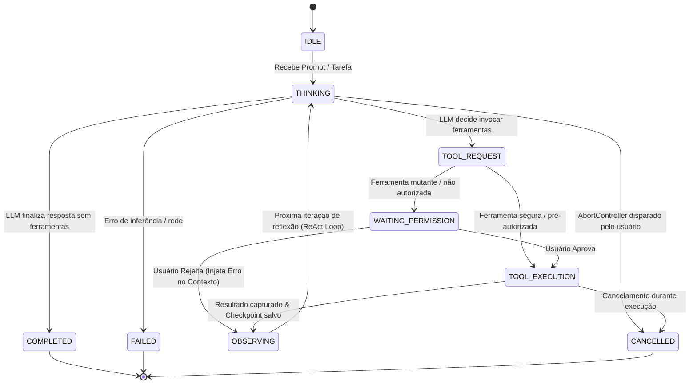

# Neo Agent Runtime (Harness Autônomo)

O **Neo Agent Runtime** (`electron/agent/`) é o subsistema de execução autônoma do NeoChat Desktop. Ele transforma o aplicativo de um assistente de chat convencional em um **agente de engenharia de software autônomo**, capaz de inspecionar workspaces, planejar e executar ações em múltiplos passos, rodar comandos em terminal persistente, modificar arquivos com segurança transacional e aprender com o feedback do usuário.

---

## 🏛️ Arquitetura do Harness

O Neo Agent Runtime foi concebido sob princípios de confiabilidade, determinismo, rastreabilidade e segurança rigorosa:

```
+-----------------------------------------------------------------------------------+
|                              NEO AGENT RUNTIME                                    |
|                                                                                   |
|  +-----------------------------------------------------------------------------+  |
|  |                            NeoAgentRuntime Facade                           |  |
|  |                    (Criação e Gestão de AgentSession)                       |  |
|  +-----------------------------------------------------------------------------+  |
|         │                                │                             │          |
|         ▼                                ▼                             ▼          |
|  +--------------+               +------------------+           +---------------+  |
|  | AgentLoop    |               | AgentEventBus    |           | ModelRouter   |  |
|  | StateMachine | ◄───────────► | (Typed Events)   | ◄───────► | (Multi-LLM)   |  |
|  +--------------+               +------------------+           +---------------+  |
|         │                                │                             │          |
|         ▼                                ▼                             ▼          |
|  +--------------+               +------------------+           +---------------+  |
|  | Permission   |               | ToolRegistry     |           | Compaction    |  |
|  | Engine       | ◄───────────► | & ToolExecutor   | ◄───────► | Manager       |  |
|  +--------------+               +------------------+           +---------------+  |
|         │                                │                             │          |
|         ▼                                ▼                             ▼          |
|  +--------------+               +------------------+           +---------------+  |
|  | Checkpoints  |               | ShellManager     |           | Workspace     |  |
|  | (Undo/Roll)  |               | (Terminal PTY)   |           | Manager       |  |
|  +--------------+               +------------------+           +---------------+  |
+-----------------------------------------------------------------------------------+
                                          │
                                          ▼ IPC Bridge
+-----------------------------------------------------------------------------------+
|                        FRONTEND AGENT UI (REACT 19)                               |
|   [ TrajectoryView ]  [ TrajectoryTimeline ]  [ Ledger ]  [ ToolApprovalModal ]   |
+-----------------------------------------------------------------------------------+
```

---

## 🔄 Máquina de Estados Finitos (`AGENT_STATES`)

O ciclo de vida do agente segue uma máquina de estados finitos formal, garantindo que cada transição seja determinística e rastreável pelo frontend via `AgentEventBus`:



### Estados do Ciclo de Vida:

| Estado | Código | Descrição |
| :--- | :--- | :--- |
| **IDLE** | `IDLE` | Sessão ociosa aguardando novas instruções do usuário. |
| **THINKING** | `THINKING` | LLM processando contexto, gerando raciocínio (`<think>`) ou planejando a próxima ação. |
| **TOOL_REQUEST** | `TOOL_REQUEST` | Modelo solicitou uma ou mais chamadas de ferramentas (`tool_calls`). |
| **WAITING_PERMISSION** | `WAITING_PERMISSION` | Execução pausada aguardando decisão explícita do usuário na UI. |
| **TOOL_EXECUTION** | `TOOL_EXECUTION` | Executando a ferramenta (leitura de arquivo, comando shell, MCP, busca). |
| **OBSERVING** | `OBSERVING` | Saída da ferramenta formatada e injetada no histórico para a próxima reflexão. |
| **COMPLETED** | `COMPLETED` | Tarefa finalizada com sucesso dentro do limite de iterações. |
| **FAILED** | `FAILED` | Erro irrecuperável durante a inferência ou execução. |
| **CANCELLED** | `CANCELLED` | Execução abortada pelo usuário. |

---

## 🧭 O Loop Autônomo (`agentLoop.js`)

O `AgentLoop` orquestra até **25 iterações contínuas** (configurável) de raciocínio e ação:

1. **Injeção de Inteligência de Workspace:** Constrói o contexto do projeto ativo via `workspaceManager` (detecta `package.json`, regras do `AGENTS.md`, árvore de diretórios e branch Git).
2. **Compactação Preditiva:** O `compactionManager` avalia o consumo de tokens. Se exceder 80% do limite da janela de contexto, resume turnos antigos mantendo arquivos modificados e instruções essenciais.
3. **Inferência com Streaming:** Invoca o modelo via `modelRouter`, transmitindo deltas de texto e pensamento em tempo real via `eventBus`.
4. **Resolução de Ferramentas:** Avalia cada `tool_call` solicitada. Se nenhuma ferramenta for chamada, a resposta é finalizada.
5. **Avaliação de Risco:** Consulta o `permissionEngine`. Ferramentas de risco exigem aprovação na UI; ferramentas seguras rodam instantaneamente.
6. **Execução & Checkpointing:** Se a ferramenta modificar o filesystem, o `checkpointsManager` grava uma foto do arquivo anterior para permitir rollback imediato.
7. **Reflexão (Observing):** O resultado da execução é adicionado como mensagem `{ role: 'tool' }` e o loop avança para a próxima iteração.

---

## 🧰 Catálogo de Ferramentas Nativas (`toolRegistry.js`)

O Neo Agent Runtime possui um conjunto robusto de ferramentas nativas integradas ao sistema operacional:

```
┌─────────────────────────┬────────────────────────────────────────────────────────────────────────┐
│ Ferramenta              │ Descrição & Parâmetros                                                 │
├─────────────────────────┼────────────────────────────────────────────────────────────────────────┤
│ `read_file`             │ Leitura de arquivos completos ou faixas de linhas (`start_line`, `end`)│
│ `write_file`            │ Criação ou sobrescrita atômica de arquivos no workspace                │
│ `edit_file`             │ Edição cirúrgica de bloco contíguo exato de texto (Search & Replace)   │
│ `list_directory`        │ Listagem de diretórios com suporte a recursão e profundidade           │
│ `glob_search`           │ Busca rápida de arquivos por padrão glob (`**/*.jsx`, `src/**/*.ts`)   │
│ `grep_search`           │ Busca textual ou regex em arquivos do projeto com limitação de linhas  │
│ `shell_exec`            │ Execução de comandos no shell do workspace com timeout e captura       │
│ `git_status`            │ Leitura do status do repositório Git (arquivos modificados, staged)    │
│ `git_diff`              │ Visualização de diffs unificados e alterações pendentes                │
│ `git_commit`            │ Stage e criação de commit com mensagem estruturada                     │
│ `web_search`            │ Pesquisa em tempo real na Web (Bing Local, Tavily, Brave)              │
│ `query_project_knowledge│ Consulta semântica à base vetorial RAG do projeto                      │
│ `canvas_*`              │ Criação, edição e leitura de documentos no painel Canvas               │
└─────────────────────────┴────────────────────────────────────────────────────────────────────────┘
```

Além das ferramentas nativas, o `ToolRegistry` incorpora dinamicamente todas as ferramentas expostas por servidores **Model Context Protocol (MCP)** ativos.

---

## 🛡️ Motor de Permissões (`permissionEngine.js`)

Para manter a segurança do usuário, o motor de permissões categoriza ferramentas por nível de impacto:

```
                          ┌──────────────────────────┐
                          │  Chamada de Ferramenta   │
                          └─────────────┬────────────┘
                                        │
                    ┌───────────────────┴───────────────────┐
                    ▼                                       ▼
       [ Ferramentas Seguras (Read) ]          [ Ferramentas Mutantes (Write) ]
       • read_file                             • write_file, edit_file
       • list_directory, glob_search           • shell_exec (Comandos de Terminal)
       • grep_search, git_status               • git_commit, git_push
                    │                                       │
                    ▼                                       ▼
       [ Auto-Allow em Agent Mode ]            [ Emite Evento de Aprovação ]
       Execução Imediata                       UI exibe ToolApprovalModal
                                                            │
                                             ┌──────────────┴──────────────┐
                                             ▼                             ▼
                                      [ Permitir Uma Vez ]         [ Rejeitar ]
                                      [ Sempre Permitir ]
```

- **Sessões Isoladas:** O usuário pode clicar em *"Sempre permitir nesta sessão"* para autorizar comandos repetitivos sem interromper o fluxo autônomo.
- **Cancelamento & Timeout:** Solicitações de aprovação possuem timeout de segurança de 2 minutos para evitar bloqueio indefinido.

---

## ⏪ Checkpoints Transacionais & Rollback (`checkpoints.js`)

Qualquer mutação realizada pelo agente no sistema de arquivos é monitorada pelo `CheckpointsManager`:

1. **Pre-Mutation Snapshot:** Antes de `write_file` ou `edit_file`, o conteúdo original do arquivo e seu estado de existência são gravados na memória da sessão.
2. **Post-Mutation Verification:** O novo conteúdo é verificado após a escrita.
3. **Rollback com Um Clique:** O usuário pode reverter a última alteração via interface (`window.electron.agentRollback(sessionId)`) ou via atalho, restaurando o arquivo exatamente ao estado anterior.

---

## 🖥️ Terminal Persistente (`shellManager.js`)

O `ShellManager` controla a execução de processos de terminal no workspace:
- Isola o diretório de trabalho (`cwd`) na raiz do projeto.
- Configura variáveis de ambiente seguras (`FORCE_COLOR`, `PYTHONUNBUFFERED`).
- Controla timeouts rígidos para prevenir loops infinitos (ex: servidores que não terminam).
- Permite encerramento forçado de processos filhos (`kill`) quando a sessão é cancelada.

---

## 🧠 Compactação de Contexto (`compactionManager.js`)

Quando conversas ou execuções autônomas se estendem por muitas iterações:
- O `CompactionManager` calcula a estimativa de tokens consumidos.
- Ao atingir 80% do limite do modelo, resume os turnos mais antigos em um bloco compacto:
  - Lista de arquivos inspecionados/modificados.
  - Ferramentas executadas.
  - Principais solicitações do usuário.
- Preserva intactos os turnos recentes (últimos 6 turnos) e as instruções de sistema, evitando estouro de contexto sem perder a continuidade do raciocínio.

---

## 📊 Visualização de Trajetória no Frontend (React 19)

A experiência visual do agente é composta por quatro componentes dedicados:

1. **`TrajectoryView.jsx`:** Painel expansível que exibe o progresso em tempo real do agente.
2. **`TrajectoryTimeline.jsx`:** Linha do tempo visual indicando cada fase: Raciocínio $\rightarrow$ Ferramenta $\rightarrow$ Aprovação $\rightarrow$ Saída $\rightarrow$ Conclusão.
3. **`TrajectoryLedger.jsx`:** Histórico de auditoria detalhado de todos os passos executados na sessão, com parâmetros de entrada, saídas brutas e diffs de arquivos.
4. **`ToolApprovalModal.jsx`:** Modal de diálogo acessível com destaque de sintaxe do comando solicitado, permitindo aprovação granular ou recusa com justificativa.
