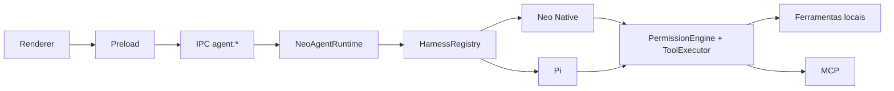

# Visão Geral da Arquitetura

O **NeoChat Desktop** é um ambiente de trabalho desktop de Inteligência Artificial de última geração, construído sob o paradigma **Local-First**, com suporte universal a múltiplos provedores de LLMs, ferramentas locais/remotas via **Model Context Protocol (MCP)**, base de conhecimento vetorial (**RAG**) e recursos de edição interativa em tempo real (**Canvas**).

---

## 🏛️ Filosofia de Engenharia e Princípios de Design

A arquitetura do NeoChat Desktop é guiada por quatro princípios fundamentais:

1. **Privacidade e Soberania dos Dados (Local-First):**
   - Histórico de conversas, credenciais, configurações e índices vetoriais de RAG residem exclusivamente na máquina do usuário.
   - Nenhuma telemetria ou dado de chat passa por servidores intermediários proprietários.

2. **Universalidade & Independência de Provedores:**
   - A camada de inferência é desacoplada de qualquer fornecedor de nuvem.
   - Alternância fluida entre APIs de alta velocidade (Groq, OpenAI, Anthropic, DeepSeek, Gemini) e motores locais 100% offline (Ollama, LM Studio).

3. **Extensibilidade Modular via Protocolos Abertos:**
   - Adoção integral do **Model Context Protocol (MCP)** da Anthropic para capacitar o modelo com acesso ao sistema de arquivos, bancos de dados, navegadores e APIs externas.

4. **Desempenho e Confiabilidade Extrema:**
   - Comunicação assíncrona orientada a eventos via IPC do Electron, com streaming push contínuo, eliminação de gargalos no thread de renderização e mitigação rigorosa de vazamentos de memória (HMR listeners cleanup).

---

## 🧩 Visão Estrutural Macro

O sistema é dividido em camadas modulares com fronteiras de segurança rigorosas:

```
+-----------------------------------------------------------------------------------------------+
|                                      SISTEMA OPERACIONAL                                      |
|    (Windows / macOS / Linux - Filesystem, SafeStorage DPAPI/Keychain, Shell PTY, Git, Rede)   |
+-----------------------------------------------------------------------------------------------+
                                               ▲
                                               │ Chamadas de Sistema, stdio & Processos
                                               ▼
+-----------------------------------------------------------------------------------------------+
|                              PROCESSO PRINCIPAL (ELECTRON MAIN)                               |
|                                       (Node.js Runtime)                                       |
|                                                                                               |
|   +---------------------------------------------------------------------------------------+   |
|   |                        NEO AGENT RUNTIME (electron/agent/)                            |   |
|   |   • runtime/sessionStore          • harnessRegistry           • eventBus (Typed)      |   |
|   |   • Native: agentLoop/modelRouter • Pi: pi-agent-core/pi-ai   • toolRegistry/Executor |   |
|   |   • permissionEngine              • checkpoints/path policies • workspace/compaction  |   |
|   +---------------------------------------------------------------------------------------+   |
|                                                                                               |
|   +-------------------+  +-------------------+  +--------------------+  +-----------------+   |
|   |    chatHandler    |  |    mcpManager     |  |     ragService     |  |  projectManager |   |
|   |  (Chat Streaming) |  | (Stdio/SSE MCP)   |  | (Embeddings/Chunks)|  | (Workspaces)    |   |
|   +-------------------+  +-------------------+  +--------------------+  +-----------------+   |
|                                                                                               |
|   +-------------------+  +-------------------+  +--------------------+  +-----------------+   |
|   |    gitManager     |  |    codeRunner     |  |  webSearchService  |  |  screenCapture  |   |
|   |  (Git Status/Diff)|  | (Python / Node)   |  | (Bing/Tavily/Brave)|  | (Window/Screen) |   |
|   +-------------------+  +-------------------+  +--------------------+  +-----------------+   |
|                                                                                               |
|   +-------------------+  +-------------------+  +--------------------+  +-----------------+   |
|   |  settingsManager  |  |    secretStore    |  |   backupManager    |  |  canvasManager  |   |
|   |  & configDirMgr   |  | (safeStorage API) |  | (Export / Recovery)|  | (Monaco / TTS)  |   |
|   +-------------------+  +-------------------+  +--------------------+  +-----------------+   |
|                                                                                               |
|   +-------------------+  +-------------------+  +--------------------+  +-----------------+   |
|   |  workflowManager  |  |  schedulerManager |  |  systemMonitor     |  |  authManager    |   |
|   |  (Automations)    |  | (Cron Background) |  | (Hardware Stats)   |  | (OAuth 2.0 MCP) |   |
|   +-------------------+  +-------------------+  +--------------------+  +-----------------+   |
+-----------------------------------------------------------------------------------------------+
                                               ▲
                                               │ IPC Bridge Seguro (preload.js)
                                               │ contextIsolation: true, nodeIntegration: false
                                               ▼
+-----------------------------------------------------------------------------------------------+
|                             PROCESSO DE RENDERIZAÇÃO (FRONTEND)                               |
|                                  (Chromium / React 19 / Vite)                                 |
|                                                                                               |
|   +-------------------+  +-------------------+  +--------------------+  +-----------------+   |
|   |    Chat Stream    |  |   Agent Harness   |  |   Canvas Editor    |  |   Quick Popup   |   |
|   | (Markdown/KaTeX)  |  | (Trajectory Ledger|  |  (Monaco Editor +  |  | (Spotlight Ctrl |   |
|   | & Branching Tree  |  |  & Approvals)     |  |   Live Preview)    |  |  + G Shortcut)  |   |
|   +-------------------+  +-------------------+  +--------------------+  +-----------------+   |
|                                                                                               |
|   +---------------------------------------------------------------------------------------+   |
|   |         State Contexts, Radix Primitives, Tailwind CSS, Lucide Icons, I18n Engine     |   |
|   +---------------------------------------------------------------------------------------+   |
+-----------------------------------------------------------------------------------------------+
```

---

## 🔄 Fluxos de Execução

O NeoChat opera em dois modos primários de interação:

### 1. Modo Conversacional (Chat Stream)
1. **Disparo:** O usuário submete a mensagem na interface React 19.
2. **Ponte IPC:** Invocação de `window.electron.startChatStream(params)`.
3. **Resolução de Contexto:** O `chatHandler.js` recupera credenciais seguras do `secretStore.js`, anexa fragmentos do `ragService` e monta o histórico podado com `messageUtils.js`.
4. **Streaming Contínuo:** Chunks de raciocínio (`<think>`) e conteúdo são emitidos em tempo real para a interface.
5. **Persistência Atômica:** A conversa é salva pelo `chatHistoryManager.js` com suporte a ramificação em árvore (Chat Branching).

### 2. Modo Agente Autônomo (Neo Agent Runtime)
1. **Inicialização de Sessão:** `NeoAgentRuntime.createSession({ workspaceRoot, model })` cria uma sessão isolada, com barramento tipado e persistência local.
2. **Seleção do Harness:** o `HarnessRegistry` resolve `settings.agentHarness`; `native` é o padrão e `pi` ativa o adapter Pi.
3. **Loop Autônomo:** o adapter conduz o modelo e publica o ciclo `THINKING` → `TOOL_REQUEST` → `TOOL_EXECUTION` → `OBSERVING` no mesmo protocolo de eventos.
4. **Avaliação de Segurança:** toda chamada passa pelo `PermissionEngine`, independentemente do harness, e pode ser permitida, bloqueada ou submetida ao `ToolApprovalModal`.
5. **Execução Controlada:** o `ToolExecutor` aplica limites de workspace e processo, cria checkpoints antes de mutações e executa ferramentas nativas ou MCP.
6. **Persistência e Auditoria:** `SessionStore` e o ledger registram a trajetória; eventos via IPC atualizam a timeline no renderer.

### Fluxo de dependências do modo agente


